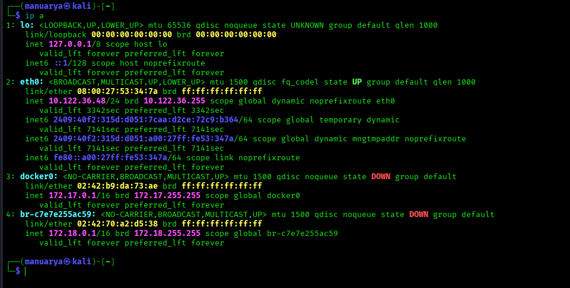
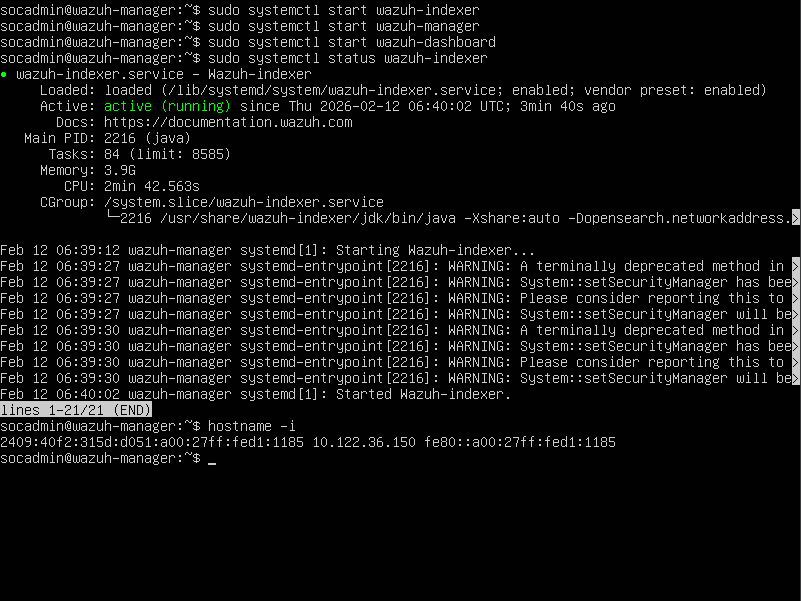
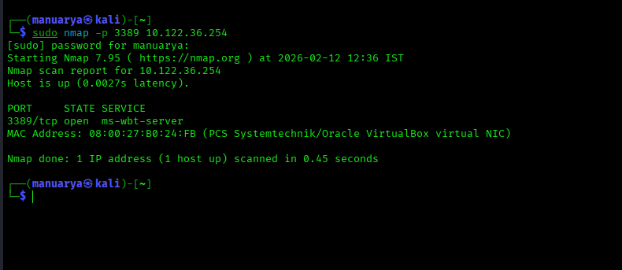
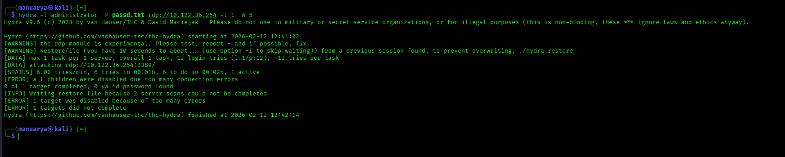
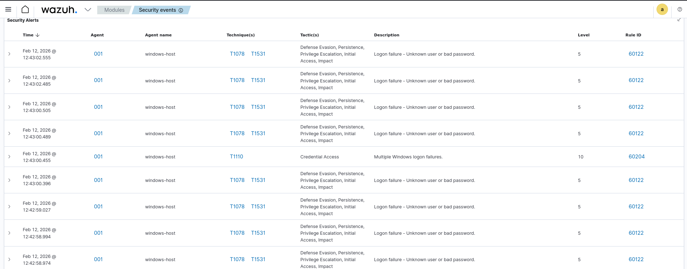
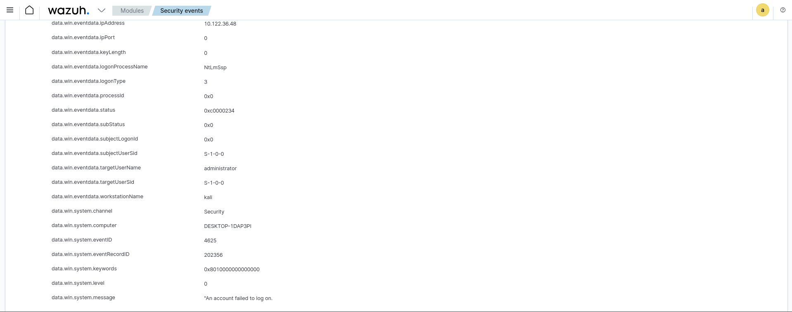

# 🔐 Wazuh SIEM – Windows Brute Force Detection Lab

## 📌 Project Overview

This project demonstrates detecting Windows brute-force login attacks using Wazuh SIEM in a virtual lab environment.
A real attack was simulated from Kali Linux against a Windows machine, and Wazuh successfully detected authentication failures and mapped them to MITRE ATT&CK techniques.

---

## 🏗️ Lab Environment Setup

### 🖥️ Windows Target Machine

### 🐉 Kali Linux Attacker Machine

### 🛡️ Wazuh SIEM Server

---

## 🎯 Objectives

* Monitor Windows authentication logs
* Detect brute-force login attempts
* Generate real-time SIEM alerts
* Map attacks to MITRE ATT&CK framework

---

## 🛠️ Tools Used

* Wazuh SIEM
* Kali Linux
* Windows 10
* Hydra (Brute-force tool)
* Nmap (Reconnaissance)
* VirtualBox

---

## 🔎 Step 1 – Reconnaissance (Nmap Scan)

RDP service discovery on Windows target:

---

## 💣 Step 2 – Brute Force Attack (Hydra)

Simulated multiple login attempts from Kali:

---

## 🚨 Step 3 – Detection: Authentication Failures

Wazuh detected Windows Event ID 4625:

---

## 📊 Step 4 – Security Events Monitoring

Real-time SIEM alerts generated:

---

## 🧠 Step 5 – MITRE ATT&CK Mapping

Attack automatically mapped to:

* T1110 – Brute Force
* T1078 – Valid Accounts

---

## 📈 Step 6 – Wazuh Dashboard Overview

Complete visualization of alerts and attack activity:

---

## 📊 Detection Results

* Multiple failed login alerts generated
* Authentication failure events monitored
* Attack severity level identified
* Real-time dashboard visualization
* MITRE ATT&CK mapping enabled

---

## 🧠 Skills Demonstrated

* SIEM deployment & configuration
* Log analysis & monitoring
* Threat detection
* Windows security event investigation
* SOC workflow understanding
* MITRE ATT&CK mapping

---

## 🔐 Ethical Note

This lab was performed in a controlled virtual environment for cybersecurity learning and defensive security research purposes only.

---

## 👤 Author

MANOJ
Cybersecurity Student | SOC & SIEM Enthusiast
Linkedin https://linkedin.com/in/manoj-8a4a05292
